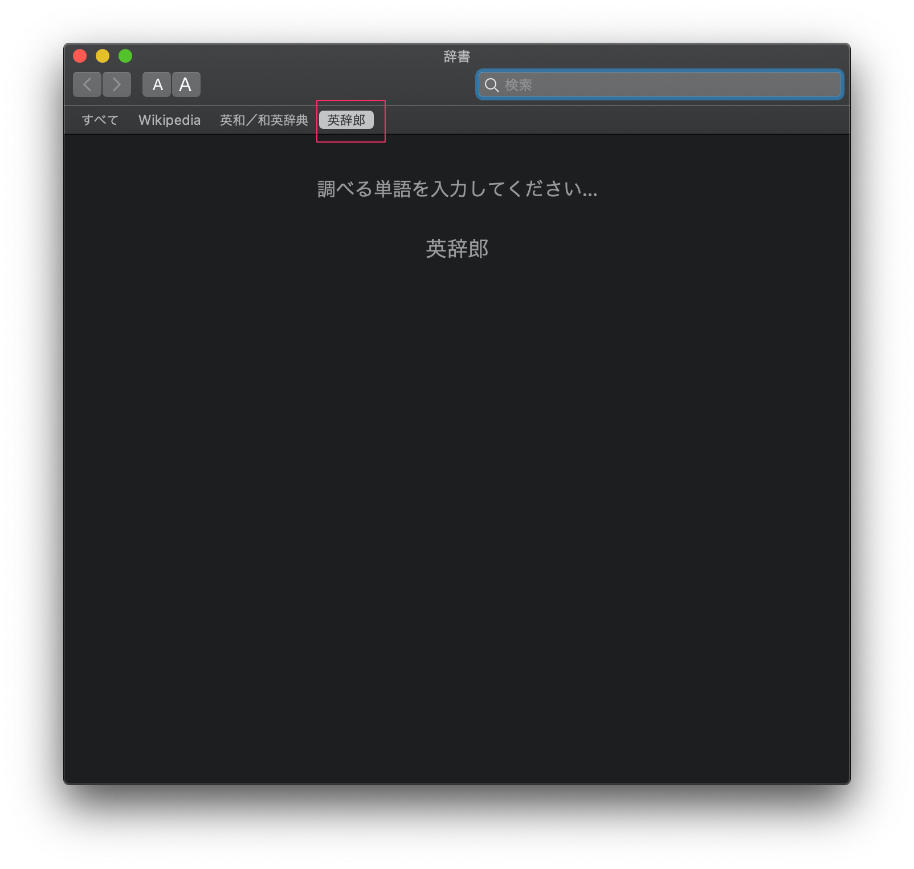
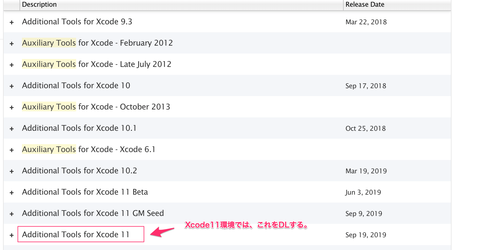
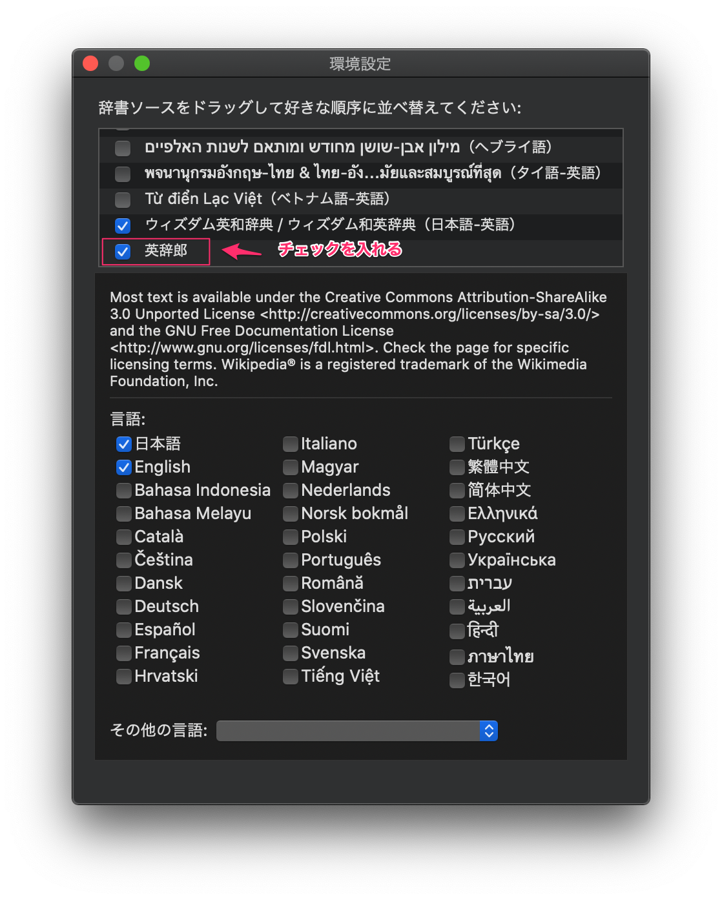

# make_eijiro_dic
英辞郎のテキストファイルをMac用の辞書に変換

[OS Xの「辞書」アプリで「英辞郎」を使う](http://www.binword.com/blog/archives/000569.html) の一部を変更したものになります。



# 事前準備
- [英辞郎の辞書を購入](https://booth.pm/ja/items/777563)
- ruby (自分は`2.3.6`で実行しております。)
- Xcode11

# Auxiliary Tools for Xcodeのインストール

Xcode11では、Additional Tools for Xcode 11に統合されております。

https://developer.apple.com/download/more/
よりDLしてください。



DLしたファイルから、`Dictionary Development Kit` を探して任意のDirにコピーしてください。※1

※1 コピーしたファイルに合わせて、Makefileの `DICT_BUILD_TOOL_DIR` のパスを変更してください。


# 英辞郎をUTF-8に変換

- nkfをインストール
```
brew install nkf
```

CP932 → UTF-8変換
```
nkf -w --cp932 英辞郎.txt > eijiro-utf8.txt
```

# 辞書作成手順

eijiro-utf8.txt を make_eijiro_dic 配下にコピーして以下のコマンドを実行してください。
※ MacBook Pro (2016)で20分弱

```
cd make_eijiro_dic
rm MyDictionary.xml; ruby eiji_conv.rb < eijiro-utf8.txt > MyDictionary.xml
```

# 英辞郎.dictionaryの作成とインストール

Makefileのパスを各環境に合わせて変更してから実行してください。
※ MacBook Pro (2016)で8時間弱

```
cd make_eijiro_dic
make; make install
```

# 辞書の適用

作成に成功していれば、以下のコマンドでファイルが作成されていることが確認できます。
```
ls ~/Library/Dictionaries/英辞郎.dictionary
```

辞書.app の環境設定にて `英辞郎` にチェックを入れてください。



